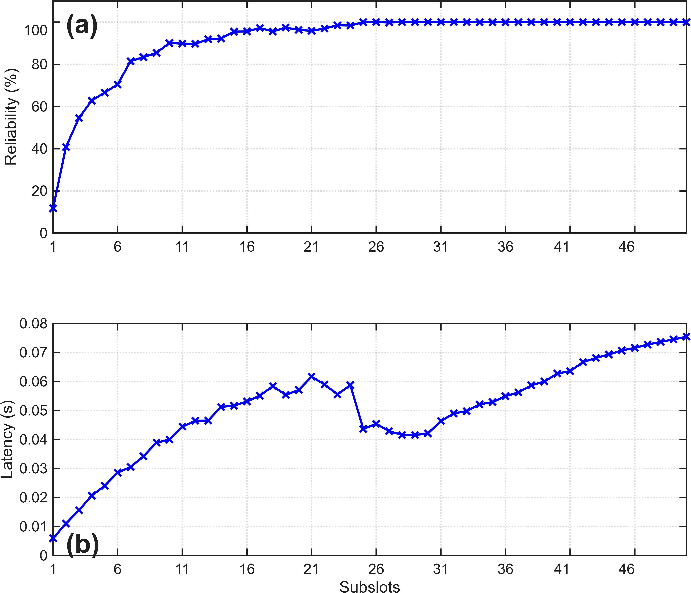
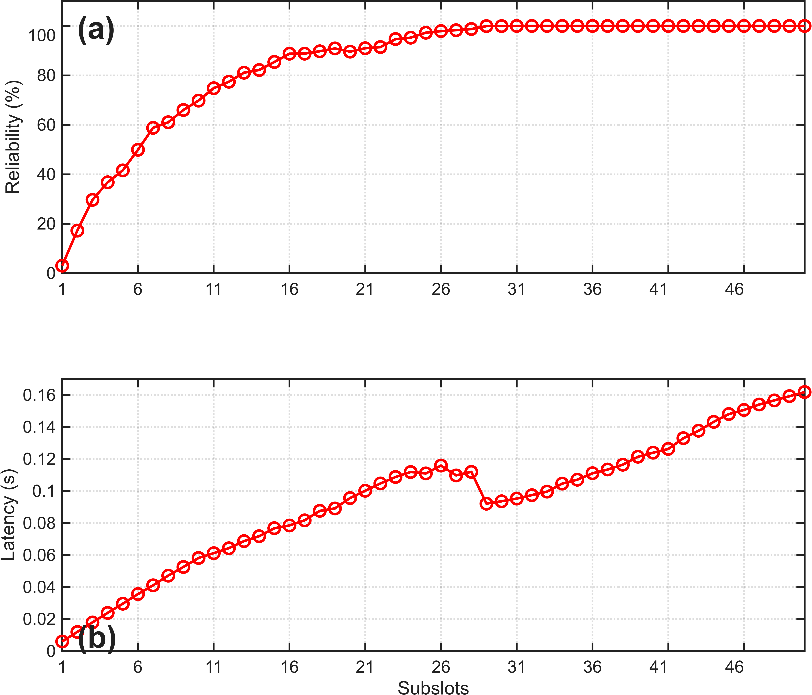
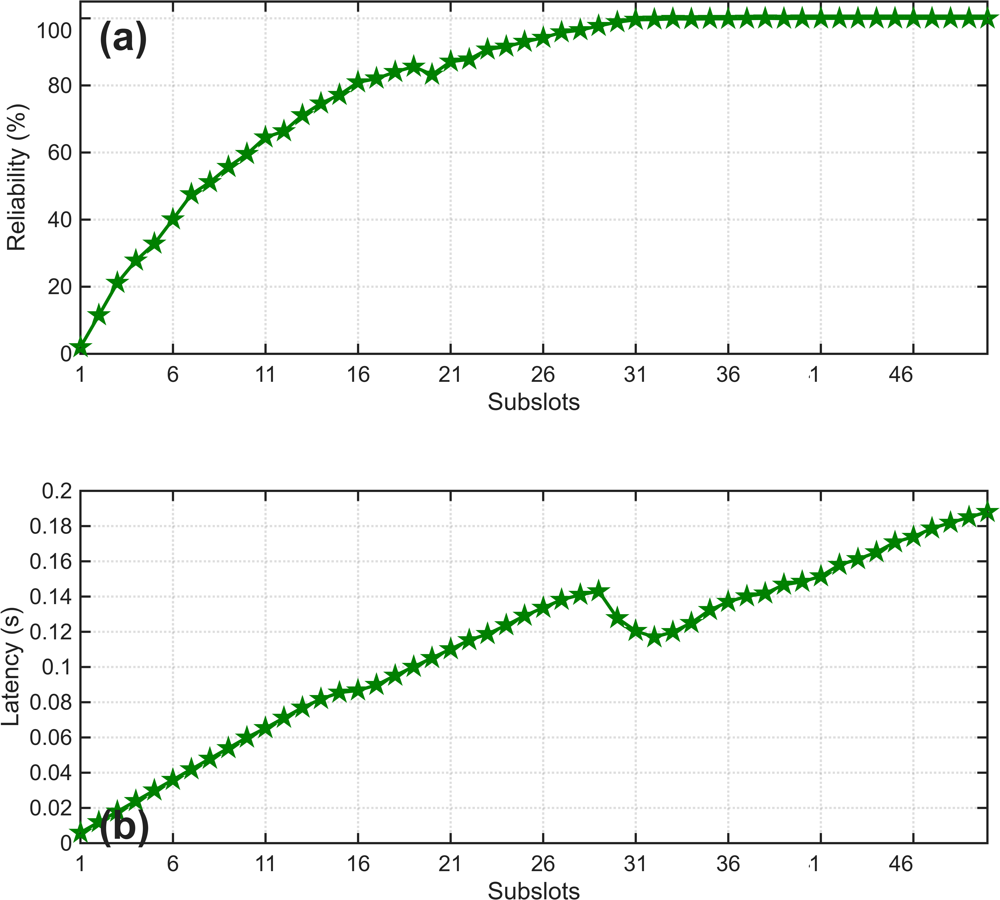
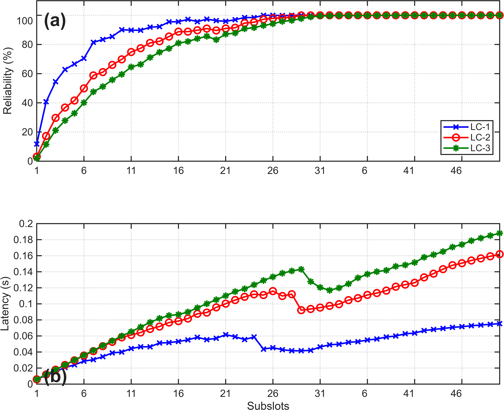

# DCube Topology Reliability and Latency Results

This folder contains the reliability and latency results obtained from simulations performed on the **DCube topology** with varying numbers of subslots.

The results are presented separately for **LC-1, LC-2, and LC-3**, along with a combined comparison of all three locality configurations.

## LC-1 Results

The following figure shows the reliability and latency results for **LC-1**.

## LC-2 Results

The following figure shows the reliability and latency results for **LC-2**.

## LC-3 Results

The following figure shows the reliability and latency results for **LC-3**.

## Combined Results

The following figure presents the combined reliability and latency results for **LC-1, LC-2, and LC-3**.

