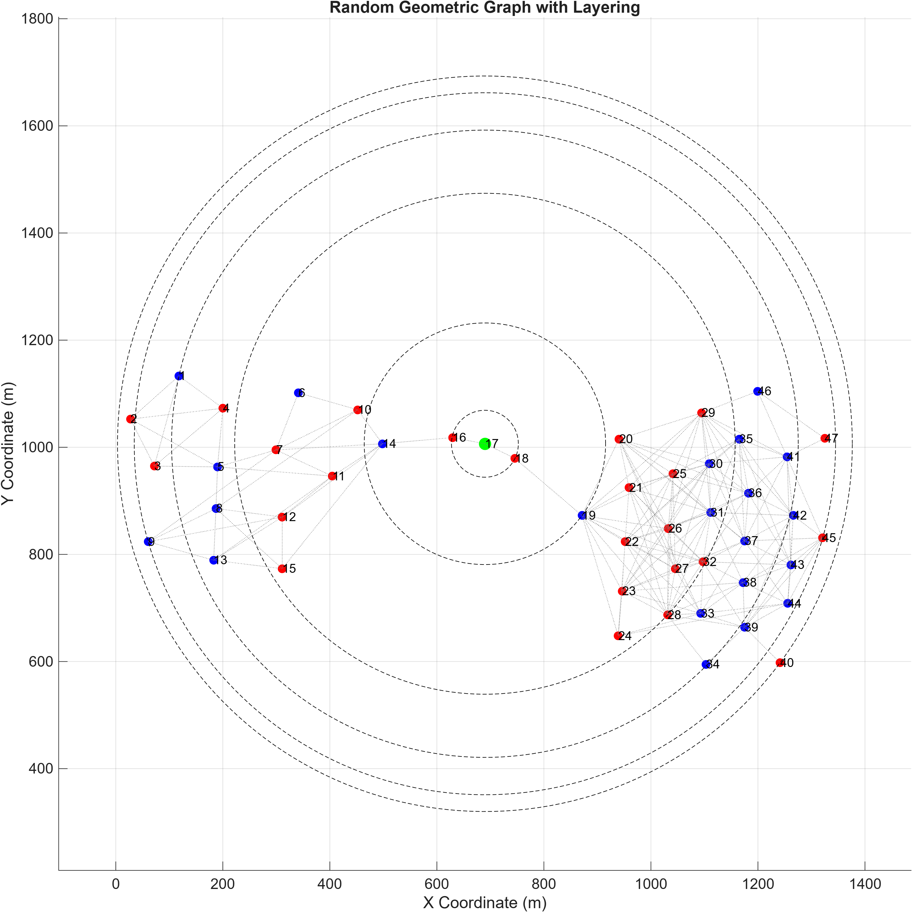

# DCube Topology

This folder contains the **DCube topology configuration** used in the LiteCast simulations.

## Topology Configuration

- **Number of Nodes:** 47
- **Center Node ID:** 17

## Node Positions

The following C++ `NodePositions` vector defines the `(x, y)` coordinates of the 47 nodes:

```cpp
vector<pair<double, double>> NodePositions = {
    {118.08, 1133.28}, {27.36, 1052.64},
    {72.00, 964.80}, {200.16, 1072.80},
    {190.08, 963.36}, {341.28, 1101.60},
    {299.52, 995.04}, {187.20, 885.60},
    {60.48, 823.68}, {452.16, 1069.92},
    {404.64, 946.08}, {311.04, 869.76},
    {182.88, 789.12}, {498.24, 1006.56},
    {311.04, 773.28}, {629.28, 1018.08},
    {689.76, 1006.56}, {745.92, 979.20},
    {871.20, 872.64}, {940.32, 1015.20},
    {959.04, 924.48}, {951.84, 823.68},
    {946.08, 731.52}, {938.88, 648.00},
    {1041.12, 950.40}, {1032.48, 848.16},
    {1045.44, 773.28}, {1031.04, 686.88},
    {1094.40, 1064.16}, {1108.80, 969.12},
    {1111.68, 878.40}, {1097.28, 786.24},
    {1092.96, 689.76}, {1103.04, 594.72},
    {1164.96, 1015.20}, {1182.24, 914.40},
    {1175.04, 825.12}, {1172.16, 747.36},
    {1175.04, 663.84}, {1241.28, 597.60},
    {1254.24, 982.08}, {1265.76, 872.64},
    {1261.44, 780.48}, {1255.68, 708.48},
    {1320.48, 830.88}, {1199.52, 1104.48},
    {1324.80, 1016.64}
};
```

## Nodes Initialization

Each node is initialized with its node ID, position, and list of neighboring nodes.

```cpp
Nodes[1] = new Node(1, NodePositions[0].first, NodePositions[0].second, {2, 3, 4});
Nodes[2] = new Node(2, NodePositions[1].first, NodePositions[1].second, {1, 3, 4, 5});
Nodes[3] = new Node(3, NodePositions[2].first, NodePositions[2].second, {1, 2, 4, 5});
Nodes[4] = new Node(4, NodePositions[3].first, NodePositions[3].second, {1, 2, 3, 5});
Nodes[5] = new Node(5, NodePositions[4].first, NodePositions[4].second, {2, 3, 4, 7, 8, 11});
Nodes[6] = new Node(6, NodePositions[5].first, NodePositions[5].second, {7, 10});
Nodes[7] = new Node(7, NodePositions[6].first, NodePositions[6].second, {5, 6, 9, 10, 11, 14});
Nodes[8] = new Node(8, NodePositions[7].first, NodePositions[7].second, {5, 9, 10, 12, 13, 15});
Nodes[9] = new Node(9, NodePositions[8].first, NodePositions[8].second, {7, 8, 12, 13});
Nodes[10] = new Node(10, NodePositions[9].first, NodePositions[9].second, {6, 7, 8, 14});
Nodes[11] = new Node(11, NodePositions[10].first, NodePositions[10].second, {5, 7, 12, 13, 14});
Nodes[12] = new Node(12, NodePositions[11].first, NodePositions[11].second, {8, 9, 11, 13, 14, 15});
Nodes[13] = new Node(13, NodePositions[12].first, NodePositions[12].second, {8, 9, 11, 12, 15});
Nodes[14] = new Node(14, NodePositions[13].first, NodePositions[13].second, {7, 10, 11, 12, 15, 16});
Nodes[15] = new Node(15, NodePositions[14].first, NodePositions[14].second, {8, 12, 13, 14});
Nodes[16] = new Node(16, NodePositions[15].first, NodePositions[15].second, {14, 17});
Nodes[17] = new Node(17, NodePositions[16].first, NodePositions[16].second, {16, 18});
Nodes[18] = new Node(18, NodePositions[17].first, NodePositions[17].second, {17, 19});
Nodes[19] = new Node(19, NodePositions[18].first, NodePositions[18].second, {18, 20, 21, 22, 23, 24, 25, 26, 27, 28, 29, 32});
Nodes[20] = new Node(20, NodePositions[19].first, NodePositions[19].second, {19, 21, 25, 26, 27, 29, 30, 31, 33, 36, 37});
Nodes[21] = new Node(21, NodePositions[20].first, NodePositions[20].second, {19, 20, 22, 25, 26, 27, 28, 29, 30, 31, 32});
Nodes[22] = new Node(22, NodePositions[21].first, NodePositions[21].second, {19, 21, 23, 24, 25, 26, 27, 28, 30, 31, 32, 33, 35});
Nodes[23] = new Node(23, NodePositions[22].first, NodePositions[22].second, {19, 22, 24, 25, 26, 27, 28, 30, 31, 32, 33, 38});
Nodes[24] = new Node(24, NodePositions[23].first, NodePositions[23].second, {19, 22, 23, 33, 44});
Nodes[25] = new Node(25, NodePositions[24].first, NodePositions[24].second, {19, 20, 21, 22, 23, 26, 27, 28, 29, 30, 31, 35, 36});
Nodes[26] = new Node(26, NodePositions[25].first, NodePositions[25].second, {19, 20, 21, 22, 23, 25, 27, 28, 29, 30, 31, 32, 36});
Nodes[27] = new Node(27, NodePositions[26].first, NodePositions[26].second, {19, 20, 21, 22, 23, 25, 26, 28, 30, 31, 32, 33, 37});
Nodes[28] = new Node(28, NodePositions[27].first, NodePositions[27].second, {19, 21, 22, 23, 25, 26, 27, 31, 32, 33, 34, 38, 39});
Nodes[29] = new Node(29, NodePositions[28].first, NodePositions[28].second, {19, 20, 21, 25, 26, 30, 31, 35, 36, 37, 41, 42, 46});
Nodes[30] = new Node(30, NodePositions[29].first, NodePositions[29].second, {20, 21, 22, 23, 25, 26, 27, 29, 31, 35, 36, 37, 41});
Nodes[31] = new Node(31, NodePositions[30].first, NodePositions[30].second, {20, 21, 22, 23, 25, 26, 27, 28, 29, 30, 32, 35, 36, 37, 38, 42});
Nodes[32] = new Node(32, NodePositions[31].first, NodePositions[31].second, {19, 21, 22, 23, 26, 27, 28, 31, 33, 36, 37, 38, 39, 43});
Nodes[33] = new Node(33, NodePositions[32].first, NodePositions[32].second, {20, 22, 23, 24, 27, 28, 32, 37, 38, 39, 44});
Nodes[34] = new Node(34, NodePositions[33].first, NodePositions[33].second, {28, 39});
Nodes[35] = new Node(35, NodePositions[34].first, NodePositions[34].second, {22, 25, 29, 30, 31, 36, 37, 41, 42, 43});
Nodes[36] = new Node(36, NodePositions[35].first, NodePositions[35].second, {20, 25, 26, 29, 30, 31, 32, 35, 37, 41, 42, 43});
Nodes[37] = new Node(37, NodePositions[36].first, NodePositions[36].second, {20, 27, 29, 30, 31, 32, 33, 35, 36, 41, 42, 43, 44, 45});
Nodes[38] = new Node(38, NodePositions[37].first, NodePositions[37].second, {23, 28, 31, 32, 33, 39, 42, 43, 44, 45});
Nodes[39] = new Node(39, NodePositions[38].first, NodePositions[38].second, {28, 32, 33, 34, 38, 40, 42, 43, 44, 45});
Nodes[40] = new Node(40, NodePositions[39].first, NodePositions[39].second, {39});
Nodes[41] = new Node(41, NodePositions[40].first, NodePositions[40].second, {29, 30, 35, 36, 37, 42, 43, 45, 46, 47});
Nodes[42] = new Node(42, NodePositions[41].first, NodePositions[41].second, {29, 31, 35, 36, 37, 38, 39, 41, 43, 44, 45});
Nodes[43] = new Node(43, NodePositions[42].first, NodePositions[42].second, {32, 35, 36, 37, 38, 39, 41, 42, 44, 45});
Nodes[44] = new Node(44, NodePositions[43].first, NodePositions[43].second, {24, 33, 37, 38, 39, 42, 43, 45});
Nodes[45] = new Node(45, NodePositions[44].first, NodePositions[44].second, {37, 38, 39, 41, 42, 43, 44});
Nodes[46] = new Node(46, NodePositions[45].first, NodePositions[45].second, {29, 41, 47});
Nodes[47] = new Node(47, NodePositions[46].first, NodePositions[46].second, {41, 46});
```

## DCube Topology Visualization

The following figure shows the DCube topology, including node positions, connectivity, layer assignments, and layer boundaries.


