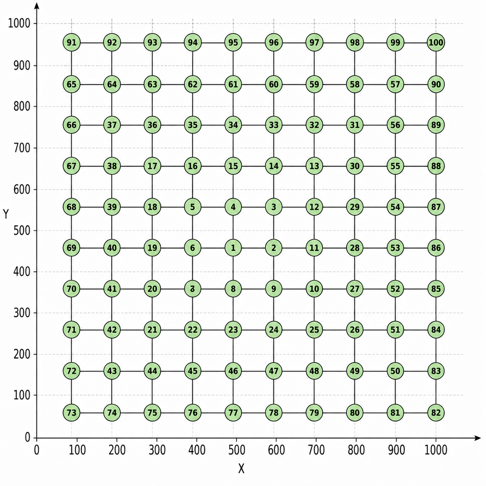

# 10x10 Grid Topology

This folder contains the **10x10 grid topology** used in the LiteCast simulations.

## Topology Configuration

- **Grid Size:** 10x10
- **Number of Nodes:** 100
- **Center Node ID:** 1

## Node Positions

The following C++ `NodePositions` vector defines the `(x, y)` coordinates of the 100 nodes:

```cpp
vector<pair<double,double>> NodePositions = {
    {450.0, 550.0}, // Node 1
    {550.0, 550.0}, // Node 2
    {550.0, 650.0}, // Node 3
    {450.0, 650.0}, // Node 4
    {350.0, 650.0}, // Node 5
    {350.0, 550.0}, // Node 6
    {350.0, 450.0}, // Node 7
    {450.0, 450.0}, // Node 8
    {550.0, 450.0}, // Node 9
    {650.0, 450.0}, // Node 10
    {650.0, 550.0}, // Node 11
    {650.0, 650.0}, // Node 12
    {650.0, 750.0}, // Node 13
    {550.0, 750.0}, // Node 14
    {450.0, 750.0}, // Node 15
    {350.0, 750.0}, // Node 16
    {250.0, 750.0}, // Node 17
    {250.0, 650.0}, // Node 18
    {250.0, 550.0}, // Node 19
    {250.0, 450.0}, // Node 20
    {250.0, 350.0}, // Node 21
    {350.0, 350.0}, // Node 22
    {450.0, 350.0}, // Node 23
    {550.0, 350.0}, // Node 24
    {650.0, 350.0}, // Node 25
    {750.0, 350.0}, // Node 26
    {750.0, 450.0}, // Node 27
    {750.0, 550.0}, // Node 28
    {750.0, 650.0}, // Node 29
    {750.0, 750.0}, // Node 30
    {750.0, 850.0}, // Node 31
    {650.0, 850.0}, // Node 32
    {550.0, 850.0}, // Node 33
    {450.0, 850.0}, // Node 34
    {350.0, 850.0}, // Node 35
    {250.0, 850.0}, // Node 36
    {150.0, 850.0}, // Node 37
    {150.0, 750.0}, // Node 38
    {150.0, 650.0}, // Node 39
    {150.0, 550.0}, // Node 40
    {150.0, 450.0}, // Node 41
    {150.0, 350.0}, // Node 42
    {150.0, 250.0}, // Node 43
    {250.0, 250.0}, // Node 44
    {350.0, 250.0}, // Node 45
    {450.0, 250.0}, // Node 46
    {550.0, 250.0}, // Node 47
    {650.0, 250.0}, // Node 48
    {750.0, 250.0}, // Node 49
    {850.0, 250.0}, // Node 50
    {850.0, 350.0}, // Node 51
    {850.0, 450.0}, // Node 52
    {850.0, 550.0}, // Node 53
    {850.0, 650.0}, // Node 54
    {850.0, 750.0}, // Node 55
    {850.0, 850.0}, // Node 56
    {850.0, 950.0}, // Node 57
    {750.0, 950.0}, // Node 58
    {650.0, 950.0}, // Node 59
    {550.0, 950.0}, // Node 60
    {450.0, 950.0}, // Node 61
    {350.0, 950.0}, // Node 62
    {250.0, 950.0}, // Node 63
    {150.0, 950.0}, // Node 64
    {50.0, 950.0}, // Node 65
    {50.0, 850.0}, // Node 66
    {50.0, 750.0}, // Node 67
    {50.0, 650.0}, // Node 68
    {50.0, 550.0}, // Node 69
    {50.0, 450.0}, // Node 70
    {50.0, 350.0}, // Node 71
    {50.0, 250.0}, // Node 72
    {50.0, 150.0}, // Node 73
    {150.0, 150.0}, // Node 74
    {250.0, 150.0}, // Node 75
    {350.0, 150.0}, // Node 76
    {450.0, 150.0}, // Node 77
    {550.0, 150.0}, // Node 78
    {650.0, 150.0}, // Node 79
    {750.0, 150.0}, // Node 80
    {850.0, 150.0}, // Node 81
    {950.0, 150.0}, // Node 82
    {950.0, 250.0}, // Node 83
    {950.0, 350.0}, // Node 84
    {950.0, 450.0}, // Node 85
    {950.0, 550.0}, // Node 86
    {950.0, 650.0}, // Node 87
    {950.0, 750.0}, // Node 88
    {950.0, 850.0}, // Node 89
    {950.0, 950.0}, // Node 90
    {50.0, 50.0}, // Node 91
    {150.0, 50.0}, // Node 92
    {250.0, 50.0}, // Node 93
    {350.0, 50.0}, // Node 94
    {450.0, 50.0}, // Node 95
    {550.0, 50.0}, // Node 96
    {650.0, 50.0}, // Node 97
    {750.0, 50.0}, // Node 98
    {850.0, 50.0}, // Node 99
    {950.0, 50.0} // Node 100
};
```

## Nodes Initialization

Each node is initialized with its node ID, position, and list of neighboring nodes:

```cpp
Nodes[1] = new Node(1, NodePositions[0].first, NodePositions[0].second, {4, 8, 6, 2});
Nodes[2] = new Node(2, NodePositions[1].first, NodePositions[1].second, {3, 9, 1, 11});
Nodes[3] = new Node(3, NodePositions[2].first, NodePositions[2].second, {14, 2, 4, 12});
Nodes[4] = new Node(4, NodePositions[3].first, NodePositions[3].second, {15, 1, 5, 3});
Nodes[5] = new Node(5, NodePositions[4].first, NodePositions[4].second, {16, 6, 18, 4});
Nodes[6] = new Node(6, NodePositions[5].first, NodePositions[5].second, {5, 7, 19, 1});
Nodes[7] = new Node(7, NodePositions[6].first, NodePositions[6].second, {6, 22, 20, 8});
Nodes[8] = new Node(8, NodePositions[7].first, NodePositions[7].second, {1, 23, 7, 9});
Nodes[9] = new Node(9, NodePositions[8].first, NodePositions[8].second, {2, 24, 8, 10});
Nodes[10] = new Node(10, NodePositions[9].first, NodePositions[9].second, {11, 25, 9, 27});
Nodes[11] = new Node(11, NodePositions[10].first, NodePositions[10].second, {12, 10, 2, 28});
Nodes[12] = new Node(12, NodePositions[11].first, NodePositions[11].second, {13, 11, 3, 29});
Nodes[13] = new Node(13, NodePositions[12].first, NodePositions[12].second, {32, 12, 14, 30});
Nodes[14] = new Node(14, NodePositions[13].first, NodePositions[13].second, {33, 3, 15, 13});
Nodes[15] = new Node(15, NodePositions[14].first, NodePositions[14].second, {34, 4, 16, 14});
Nodes[16] = new Node(16, NodePositions[15].first, NodePositions[15].second, {35, 5, 17, 15});
Nodes[17] = new Node(17, NodePositions[16].first, NodePositions[16].second, {36, 18, 38, 16});
Nodes[18] = new Node(18, NodePositions[17].first, NodePositions[17].second, {17, 19, 39, 5});
Nodes[19] = new Node(19, NodePositions[18].first, NodePositions[18].second, {18, 20, 40, 6});
Nodes[20] = new Node(20, NodePositions[19].first, NodePositions[19].second, {19, 21, 41, 7});
Nodes[21] = new Node(21, NodePositions[20].first, NodePositions[20].second, {20, 44, 42, 22});
Nodes[22] = new Node(22, NodePositions[21].first, NodePositions[21].second, {7, 45, 21, 23});
Nodes[23] = new Node(23, NodePositions[22].first, NodePositions[22].second, {8, 46, 22, 24});
Nodes[24] = new Node(24, NodePositions[23].first, NodePositions[23].second, {9, 47, 23, 25});
Nodes[25] = new Node(25, NodePositions[24].first, NodePositions[24].second, {10, 48, 24, 26});
Nodes[26] = new Node(26, NodePositions[25].first, NodePositions[25].second, {27, 49, 25, 51});
Nodes[27] = new Node(27, NodePositions[26].first, NodePositions[26].second, {28, 26, 10, 52});
Nodes[28] = new Node(28, NodePositions[27].first, NodePositions[27].second, {29, 27, 11, 53});
Nodes[29] = new Node(29, NodePositions[28].first, NodePositions[28].second, {30, 28, 12, 54});
Nodes[30] = new Node(30, NodePositions[29].first, NodePositions[29].second, {31, 29, 13, 55});
Nodes[31] = new Node(31, NodePositions[30].first, NodePositions[30].second, {58, 30, 32, 56});
Nodes[32] = new Node(32, NodePositions[31].first, NodePositions[31].second, {59, 13, 33, 31});
Nodes[33] = new Node(33, NodePositions[32].first, NodePositions[32].second, {60, 14, 34, 32});
Nodes[34] = new Node(34, NodePositions[33].first, NodePositions[33].second, {61, 15, 35, 33});
Nodes[35] = new Node(35, NodePositions[34].first, NodePositions[34].second, {62, 16, 36, 34});
Nodes[36] = new Node(36, NodePositions[35].first, NodePositions[35].second, {63, 17, 37, 35});
Nodes[37] = new Node(37, NodePositions[36].first, NodePositions[36].second, {64, 38, 66, 36});
Nodes[38] = new Node(38, NodePositions[37].first, NodePositions[37].second, {37, 39, 67, 17});
Nodes[39] = new Node(39, NodePositions[38].first, NodePositions[38].second, {38, 40, 68, 18});
Nodes[40] = new Node(40, NodePositions[39].first, NodePositions[39].second, {39, 41, 69, 19});
Nodes[41] = new Node(41, NodePositions[40].first, NodePositions[40].second, {40, 42, 70, 20});
Nodes[42] = new Node(42, NodePositions[41].first, NodePositions[41].second, {41, 43, 71, 21});
Nodes[43] = new Node(43, NodePositions[42].first, NodePositions[42].second, {42, 74, 72, 44});
Nodes[44] = new Node(44, NodePositions[43].first, NodePositions[43].second, {21, 75, 43, 45});
Nodes[45] = new Node(45, NodePositions[44].first, NodePositions[44].second, {22, 76, 44, 46});
Nodes[46] = new Node(46, NodePositions[45].first, NodePositions[45].second, {23, 77, 45, 47});
Nodes[47] = new Node(47, NodePositions[46].first, NodePositions[46].second, {24, 78, 46, 48});
Nodes[48] = new Node(48, NodePositions[47].first, NodePositions[47].second, {25, 79, 47, 49});
Nodes[49] = new Node(49, NodePositions[48].first, NodePositions[48].second, {26, 80, 48, 50});
Nodes[50] = new Node(50, NodePositions[49].first, NodePositions[49].second, {51, 81, 49, 83});
Nodes[51] = new Node(51, NodePositions[50].first, NodePositions[50].second, {52, 50, 26, 84});
Nodes[52] = new Node(52, NodePositions[51].first, NodePositions[51].second, {53, 51, 27, 85});
Nodes[53] = new Node(53, NodePositions[52].first, NodePositions[52].second, {54, 52, 28, 86});
Nodes[54] = new Node(54, NodePositions[53].first, NodePositions[53].second, {55, 53, 29, 87});
Nodes[55] = new Node(55, NodePositions[54].first, NodePositions[54].second, {56, 54, 30, 88});
Nodes[56] = new Node(56, NodePositions[55].first, NodePositions[55].second, {57, 55, 31, 89});
Nodes[57] = new Node(57, NodePositions[56].first, NodePositions[56].second, {56, 58, 90});
Nodes[58] = new Node(58, NodePositions[57].first, NodePositions[57].second, {31, 59, 57});
Nodes[59] = new Node(59, NodePositions[58].first, NodePositions[58].second, {32, 60, 58});
Nodes[60] = new Node(60, NodePositions[59].first, NodePositions[59].second, {33, 61, 59});
Nodes[61] = new Node(61, NodePositions[60].first, NodePositions[60].second, {34, 62, 60});
Nodes[62] = new Node(62, NodePositions[61].first, NodePositions[61].second, {35, 63, 61});
Nodes[63] = new Node(63, NodePositions[62].first, NodePositions[62].second, {36, 64, 62});
Nodes[64] = new Node(64, NodePositions[63].first, NodePositions[63].second, {37, 65, 63});
Nodes[65] = new Node(65, NodePositions[64].first, NodePositions[64].second, {66, 64});
Nodes[66] = new Node(66, NodePositions[65].first, NodePositions[65].second, {65, 67, 37});
Nodes[67] = new Node(67, NodePositions[66].first, NodePositions[66].second, {66, 68, 38});
Nodes[68] = new Node(68, NodePositions[67].first, NodePositions[67].second, {67, 69, 39});
Nodes[69] = new Node(69, NodePositions[68].first, NodePositions[68].second, {68, 70, 40});
Nodes[70] = new Node(70, NodePositions[69].first, NodePositions[69].second, {69, 71, 41});
Nodes[71] = new Node(71, NodePositions[70].first, NodePositions[70].second, {70, 72, 42});
Nodes[72] = new Node(72, NodePositions[71].first, NodePositions[71].second, {71, 73, 43});
Nodes[73] = new Node(73, NodePositions[72].first, NodePositions[72].second, {72, 91, 74});
Nodes[74] = new Node(74, NodePositions[73].first, NodePositions[73].second, {43, 92, 73, 75});
Nodes[75] = new Node(75, NodePositions[74].first, NodePositions[74].second, {44, 93, 74, 76});
Nodes[76] = new Node(76, NodePositions[75].first, NodePositions[75].second, {45, 94, 75, 77});
Nodes[77] = new Node(77, NodePositions[76].first, NodePositions[76].second, {46, 95, 76, 78});
Nodes[78] = new Node(78, NodePositions[77].first, NodePositions[77].second, {47, 96, 77, 79});
Nodes[79] = new Node(79, NodePositions[78].first, NodePositions[78].second, {48, 97, 78, 80});
Nodes[80] = new Node(80, NodePositions[79].first, NodePositions[79].second, {49, 98, 79, 81});
Nodes[81] = new Node(81, NodePositions[80].first, NodePositions[80].second, {50, 99, 80, 82});
Nodes[82] = new Node(82, NodePositions[81].first, NodePositions[81].second, {83, 100, 81});
Nodes[83] = new Node(83, NodePositions[82].first, NodePositions[82].second, {84, 82, 50});
Nodes[84] = new Node(84, NodePositions[83].first, NodePositions[83].second, {85, 83, 51});
Nodes[85] = new Node(85, NodePositions[84].first, NodePositions[84].second, {86, 84, 52});
Nodes[86] = new Node(86, NodePositions[85].first, NodePositions[85].second, {87, 85, 53});
Nodes[87] = new Node(87, NodePositions[86].first, NodePositions[86].second, {88, 86, 54});
Nodes[88] = new Node(88, NodePositions[87].first, NodePositions[87].second, {89, 87, 55});
Nodes[89] = new Node(89, NodePositions[88].first, NodePositions[88].second, {90, 88, 56});
Nodes[90] = new Node(90, NodePositions[89].first, NodePositions[89].second, {89, 57});
Nodes[91] = new Node(91, NodePositions[90].first, NodePositions[90].second, {73, 92});
Nodes[92] = new Node(92, NodePositions[91].first, NodePositions[91].second, {74, 91, 93});
Nodes[93] = new Node(93, NodePositions[92].first, NodePositions[92].second, {75, 92, 94});
Nodes[94] = new Node(94, NodePositions[93].first, NodePositions[93].second, {76, 93, 95});
Nodes[95] = new Node(95, NodePositions[94].first, NodePositions[94].second, {77, 94, 96});
Nodes[96] = new Node(96, NodePositions[95].first, NodePositions[95].second, {78, 95, 97});
Nodes[97] = new Node(97, NodePositions[96].first, NodePositions[96].second, {79, 96, 98});
Nodes[98] = new Node(98, NodePositions[97].first, NodePositions[97].second, {80, 97, 99});
Nodes[99] = new Node(99, NodePositions[98].first, NodePositions[98].second, {81, 98, 100});
Nodes[100] = new Node(100, NodePositions[99].first, NodePositions[99].second, {82, 99});
```

## Topology Visualization

The following figure shows the **10x10 grid topology**, with Node 1 as the designated center node.



