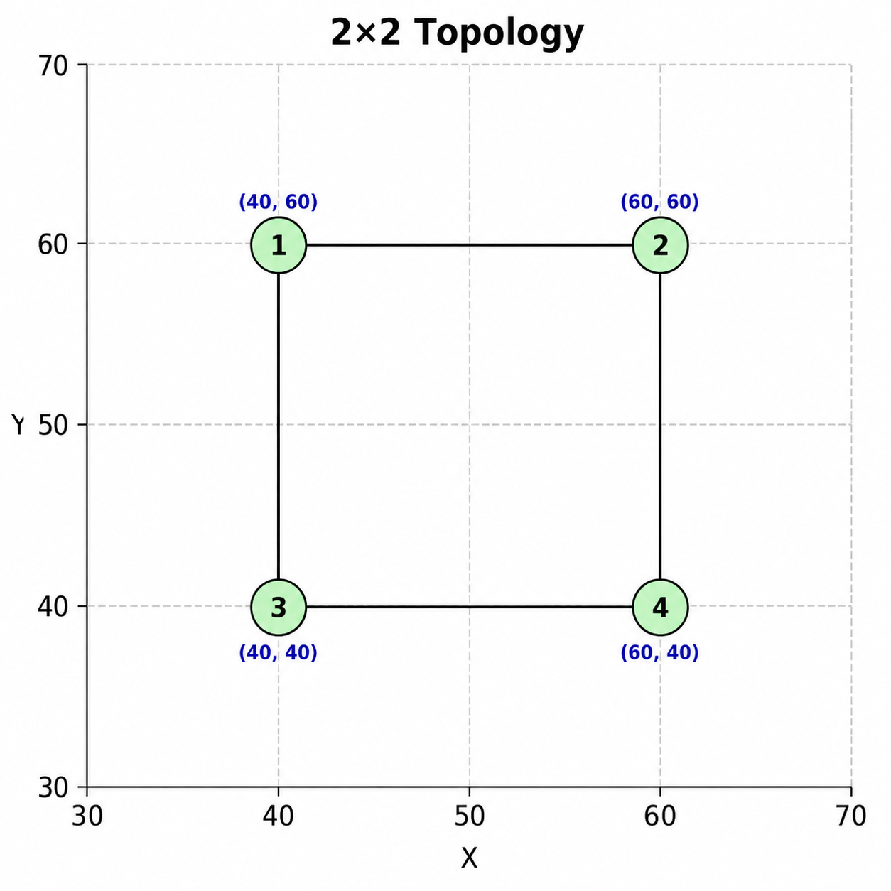

# 2x2 Grid Topology

This folder contains the **2x2 grid topology** used in the LiteCast simulations.

## Topology Configuration

- **Grid Size:** 2x2
- **Number of Nodes:** 4
- **Center Node ID:** 1

## Node Positions

The following C++ `NodePositions` vector defines the `(x, y)` coordinates of the four nodes:

```cpp
vector<pair<double, double>> NodePositions = {
    {40.0, 60.0}, // Node 1 (top-left)
    {60.0, 60.0}, // Node 2 (top-right)
    {40.0, 40.0}, // Node 3 (bottom-left)
    {60.0, 40.0}  // Node 4 (bottom-right)
};
```

## Nodes Initialization

Each node is initialized with its node ID, position, and list of neighboring nodes:

```cpp
Nodes[1] = new Node(1, NodePositions[0].first, NodePositions[0].second, {2, 3});
Nodes[2] = new Node(2, NodePositions[1].first, NodePositions[1].second, {1, 4});
Nodes[3] = new Node(3, NodePositions[2].first, NodePositions[2].second, {1, 4});
Nodes[4] = new Node(4, NodePositions[3].first, NodePositions[3].second, {2, 3});
```

## Topology Visualization

The following figure shows the **2x2 grid topology**, with Node 1 as the designated center node.


