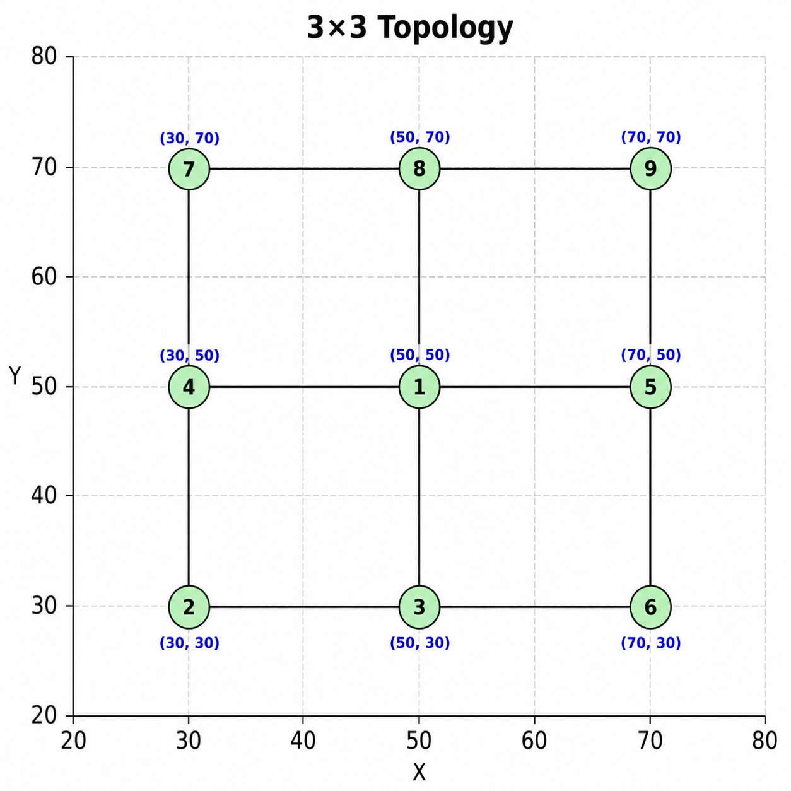

# 3x3 Grid Topology

This folder contains the **3x3 grid topology** used in the LiteCast simulations.

## Topology Configuration

- **Grid Size:** 3x3
- **Number of Nodes:** 9
- **Center Node ID:** 1

## Node Positions

The following C++ `NodePositions` vector defines the `(x, y)` coordinates of the nine nodes:

```cpp
vector<pair<double, double>> NodePositions = {
    {50.0, 50.0}, // Node 1 (center)
    {30.0, 30.0}, // Node 2 (bottom-left)
    {50.0, 30.0}, // Node 3 (bottom-center)
    {30.0, 50.0}, // Node 4 (middle-left)
    {70.0, 50.0}, // Node 5 (middle-right)
    {70.0, 30.0}, // Node 6 (bottom-right)
    {30.0, 70.0}, // Node 7 (top-left)
    {50.0, 70.0}, // Node 8 (top-center)
    {70.0, 70.0}  // Node 9 (top-right)
};
```

## Nodes Initialization

Each node is initialized with its node ID, position, and list of neighboring nodes:

```cpp
Nodes[1] = new Node(1, NodePositions[0].first, NodePositions[0].second, {3, 4, 5, 8});
Nodes[2] = new Node(2, NodePositions[1].first, NodePositions[1].second, {3, 4});
Nodes[3] = new Node(3, NodePositions[2].first, NodePositions[2].second, {1, 2, 6});
Nodes[4] = new Node(4, NodePositions[3].first, NodePositions[3].second, {1, 2, 7});
Nodes[5] = new Node(5, NodePositions[4].first, NodePositions[4].second, {1, 6, 9});
Nodes[6] = new Node(6, NodePositions[5].first, NodePositions[5].second, {3, 5});
Nodes[7] = new Node(7, NodePositions[6].first, NodePositions[6].second, {4, 8});
Nodes[8] = new Node(8, NodePositions[7].first, NodePositions[7].second, {1, 7, 9});
Nodes[9] = new Node(9, NodePositions[8].first, NodePositions[8].second, {5, 8});
```

## Topology Visualization

The following figure shows the **3x3 grid topology**, with Node 1 as the designated center node.


