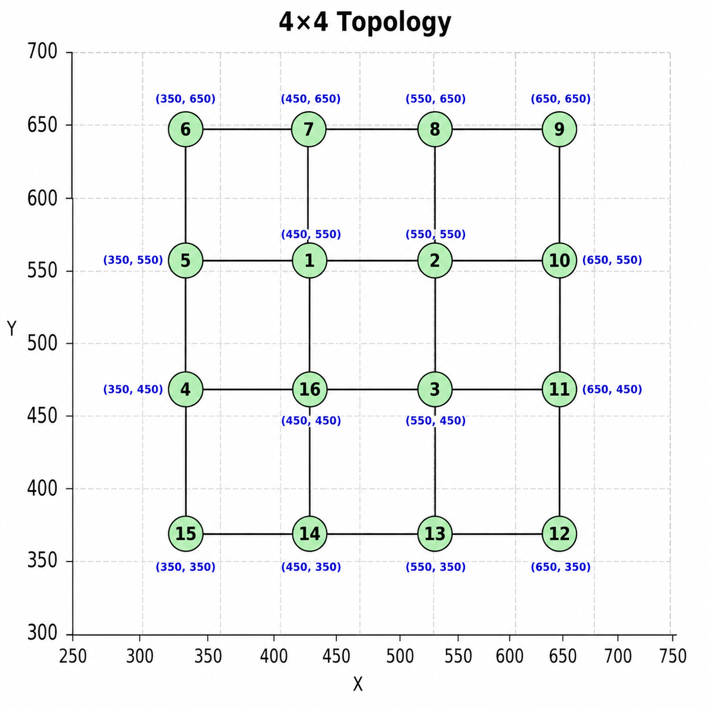

# 4x4 Grid Topology

This folder contains the **4x4 grid topology** used in the LiteCast simulations.

## Topology Configuration

- **Grid Size:** 4x4
- **Number of Nodes:** 16
- **Center Node ID:** 1

## Node Positions

The following C++ `NodePositions` vector defines the `(x, y)` coordinates of the 16 nodes:

```cpp
vector<pair<double, double>> NodePositions = {
    {450.0, 550.0}, // Node 1
    {550.0, 550.0}, // Node 2
    {550.0, 450.0}, // Node 3
    {350.0, 450.0}, // Node 4
    {350.0, 550.0}, // Node 5
    {350.0, 650.0}, // Node 6
    {450.0, 650.0}, // Node 7
    {550.0, 650.0}, // Node 8
    {650.0, 650.0}, // Node 9
    {650.0, 550.0}, // Node 10
    {650.0, 450.0}, // Node 11
    {650.0, 350.0}, // Node 12
    {550.0, 350.0}, // Node 13
    {450.0, 350.0}, // Node 14
    {350.0, 350.0}, // Node 15
    {450.0, 450.0}  // Node 16
};
```

## Nodes Initialization

Each node is initialized with its node ID, position, and list of neighboring nodes:

```cpp
Nodes[1]  = new Node(1,  NodePositions[0].first,  NodePositions[0].second,  {2, 7, 16, 5});
Nodes[2]  = new Node(2,  NodePositions[1].first,  NodePositions[1].second,  {1, 3, 8, 10});
Nodes[3]  = new Node(3,  NodePositions[2].first,  NodePositions[2].second,  {2, 16, 11, 13});
Nodes[4]  = new Node(4,  NodePositions[3].first,  NodePositions[3].second,  {5, 16, 15});
Nodes[5]  = new Node(5,  NodePositions[4].first,  NodePositions[4].second,  {6, 1, 4});
Nodes[6]  = new Node(6,  NodePositions[5].first,  NodePositions[5].second,  {7, 5});
Nodes[7]  = new Node(7,  NodePositions[6].first,  NodePositions[6].second,  {6, 8, 1});
Nodes[8]  = new Node(8,  NodePositions[7].first,  NodePositions[7].second,  {7, 9, 2});
Nodes[9]  = new Node(9,  NodePositions[8].first,  NodePositions[8].second,  {8, 10});
Nodes[10] = new Node(10, NodePositions[9].first,  NodePositions[9].second,  {9, 2, 11});
Nodes[11] = new Node(11, NodePositions[10].first, NodePositions[10].second, {10, 3, 12});
Nodes[12] = new Node(12, NodePositions[11].first, NodePositions[11].second, {11, 13});
Nodes[13] = new Node(13, NodePositions[12].first, NodePositions[12].second, {12, 14, 3});
Nodes[14] = new Node(14, NodePositions[13].first, NodePositions[13].second, {13, 15, 16});
Nodes[15] = new Node(15, NodePositions[14].first, NodePositions[14].second, {14, 4});
Nodes[16] = new Node(16, NodePositions[15].first, NodePositions[15].second, {1, 3, 4, 14});
```

## Topology Visualization

The following figure shows the **4x4 grid topology**, with Node 1 as the designated center node.


