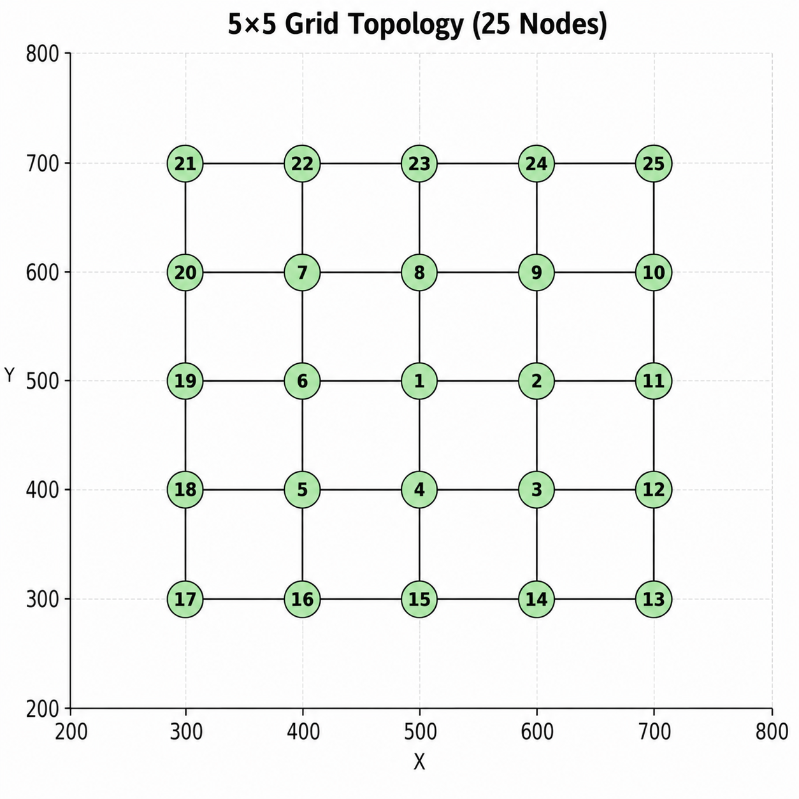

# 5x5 Grid Topology

This folder contains the **5x5 grid topology** used in the LiteCast simulations.

## Topology Configuration

- **Grid Size:** 5x5
- **Number of Nodes:** 25
- **Center Node ID:** 1

## Node Positions

The following C++ `NodePositions` vector defines the `(x, y)` coordinates of the 25 nodes:

```cpp
vector<pair<double, double>> NodePositions = {
    {500.0, 500.0}, // 1
    {600.0, 500.0}, // 2
    {600.0, 400.0}, // 3
    {500.0, 400.0}, // 4
    {400.0, 400.0}, // 5
    {400.0, 500.0}, // 6
    {400.0, 600.0}, // 7
    {500.0, 600.0}, // 8
    {600.0, 600.0}, // 9
    {700.0, 600.0}, // 10
    {700.0, 500.0}, // 11
    {700.0, 400.0}, // 12
    {700.0, 300.0}, // 13
    {600.0, 300.0}, // 14
    {500.0, 300.0}, // 15
    {400.0, 300.0}, // 16
    {300.0, 300.0}, // 17
    {300.0, 400.0}, // 18
    {300.0, 500.0}, // 19
    {300.0, 600.0}, // 20
    {300.0, 700.0}, // 21
    {400.0, 700.0}, // 22
    {500.0, 700.0}, // 23
    {600.0, 700.0}, // 24
    {700.0, 700.0}  // 25
};
```

## Nodes Initialization

Each node is initialized with its node ID, position, and list of neighboring nodes:

```cpp
Nodes[1]  = new Node(1,  NodePositions[0].first,  NodePositions[0].second,  {2, 4, 6, 8});

Nodes[2]  = new Node(2,  NodePositions[1].first,  NodePositions[1].second,  {1, 3, 9, 11});
Nodes[3]  = new Node(3,  NodePositions[2].first,  NodePositions[2].second,  {2, 4, 12});
Nodes[4]  = new Node(4,  NodePositions[3].first,  NodePositions[3].second,  {1, 3, 5, 15});
Nodes[5]  = new Node(5,  NodePositions[4].first,  NodePositions[4].second,  {4, 6, 16, 18});
Nodes[6]  = new Node(6,  NodePositions[5].first,  NodePositions[5].second,  {1, 5, 7, 19});
Nodes[7]  = new Node(7,  NodePositions[6].first,  NodePositions[6].second,  {6, 8, 20, 22});
Nodes[8]  = new Node(8,  NodePositions[7].first,  NodePositions[7].second,  {1, 7, 9, 23});
Nodes[9]  = new Node(9,  NodePositions[8].first,  NodePositions[8].second,  {2, 8, 10, 24});

Nodes[10] = new Node(10, NodePositions[9].first,  NodePositions[9].second,  {9, 11, 25});
Nodes[11] = new Node(11, NodePositions[10].first, NodePositions[10].second, {2, 10, 12});
Nodes[12] = new Node(12, NodePositions[11].first, NodePositions[11].second, {3, 11, 13});
Nodes[13] = new Node(13, NodePositions[12].first, NodePositions[12].second, {12, 14});
Nodes[14] = new Node(14, NodePositions[13].first, NodePositions[13].second, {13, 15});
Nodes[15] = new Node(15, NodePositions[14].first, NodePositions[14].second, {4, 14, 16});
Nodes[16] = new Node(16, NodePositions[15].first, NodePositions[15].second, {5, 15, 17});
Nodes[17] = new Node(17, NodePositions[16].first, NodePositions[16].second, {16, 18});
Nodes[18] = new Node(18, NodePositions[17].first, NodePositions[17].second, {5, 17, 19});
Nodes[19] = new Node(19, NodePositions[18].first, NodePositions[18].second, {6, 18, 20});

Nodes[20] = new Node(20, NodePositions[19].first, NodePositions[19].second, {7, 19, 21});
Nodes[21] = new Node(21, NodePositions[20].first, NodePositions[20].second, {20, 22});
Nodes[22] = new Node(22, NodePositions[21].first, NodePositions[21].second, {7, 21, 23});
Nodes[23] = new Node(23, NodePositions[22].first, NodePositions[22].second, {8, 22, 24});
Nodes[24] = new Node(24, NodePositions[23].first, NodePositions[23].second, {9, 23, 25});
Nodes[25] = new Node(25, NodePositions[24].first, NodePositions[24].second, {10, 24});
```

## Topology Visualization

The following figure shows the **5x5 grid topology**, with Node 1 as the designated center node.


