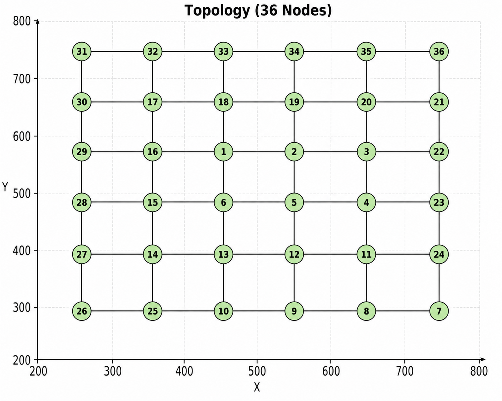

# 6x6 Grid Topology

This folder contains the **6x6 grid topology** used in the LiteCast simulations.

## Topology Configuration

- **Grid Size:** 6x6
- **Number of Nodes:** 36
- **Center Node ID:** 1

## Node Positions

The following C++ `NodePositions` vector defines the `(x, y)` coordinates of the 36 nodes:

```cpp
vector<pair<double, double>> NodePositions = {
    {450.0, 550.0}, // 1
    {550.0, 550.0}, // 2
    {650.0, 550.0}, // 3
    {650.0, 450.0}, // 4
    {550.0, 450.0}, // 5
    {450.0, 450.0}, // 6
    {750.0, 250.0}, // 7
    {650.0, 250.0}, // 8
    {550.0, 250.0}, // 9
    {450.0, 250.0}, // 10
    {650.0, 350.0}, // 11
    {550.0, 350.0}, // 12
    {450.0, 350.0}, // 13
    {350.0, 350.0}, // 14
    {350.0, 450.0}, // 15
    {350.0, 550.0}, // 16
    {350.0, 650.0}, // 17
    {450.0, 650.0}, // 18
    {550.0, 650.0}, // 19
    {650.0, 650.0}, // 20
    {750.0, 650.0}, // 21
    {750.0, 550.0}, // 22
    {750.0, 450.0}, // 23
    {750.0, 350.0}, // 24
    {350.0, 250.0}, // 25
    {250.0, 250.0}, // 26
    {250.0, 350.0}, // 27
    {250.0, 450.0}, // 28
    {250.0, 550.0}, // 29
    {250.0, 650.0}, // 30
    {250.0, 750.0}, // 31
    {350.0, 750.0}, // 32
    {450.0, 750.0}, // 33
    {550.0, 750.0}, // 34
    {650.0, 750.0}, // 35
    {750.0, 750.0}  // 36
};
```

## Nodes Initialization

Each node is initialized with its node ID, position, and list of neighboring nodes:

```cpp
Nodes[1]  = new Node(1,  NodePositions[0].first,  NodePositions[0].second,  {2, 6, 16, 18});
Nodes[2]  = new Node(2,  NodePositions[1].first,  NodePositions[1].second,  {1, 3, 5, 19});
Nodes[3]  = new Node(3,  NodePositions[2].first,  NodePositions[2].second,  {2, 4, 22, 20});
Nodes[4]  = new Node(4,  NodePositions[3].first,  NodePositions[3].second,  {3, 5, 11, 23});
Nodes[5]  = new Node(5,  NodePositions[4].first,  NodePositions[4].second,  {2, 4, 6, 12});
Nodes[6]  = new Node(6,  NodePositions[5].first,  NodePositions[5].second,  {1, 5, 13, 15});

Nodes[7]  = new Node(7,  NodePositions[6].first,  NodePositions[6].second,  {8, 24});
Nodes[8]  = new Node(8,  NodePositions[7].first,  NodePositions[7].second,  {7, 9, 11});
Nodes[9]  = new Node(9,  NodePositions[8].first,  NodePositions[8].second,  {8, 10, 12});
Nodes[10] = new Node(10, NodePositions[9].first,  NodePositions[9].second,  {9, 25});
Nodes[11] = new Node(11, NodePositions[10].first, NodePositions[10].second, {4, 8, 12, 24});
Nodes[12] = new Node(12, NodePositions[11].first, NodePositions[11].second, {5, 9, 11, 13});
Nodes[13] = new Node(13, NodePositions[12].first, NodePositions[12].second, {6, 12, 14, 10});
Nodes[14] = new Node(14, NodePositions[13].first, NodePositions[13].second, {13, 15, 27});
Nodes[15] = new Node(15, NodePositions[14].first, NodePositions[14].second, {6, 14, 16, 28});
Nodes[16] = new Node(16, NodePositions[15].first, NodePositions[15].second, {1, 15, 17, 29});

Nodes[17] = new Node(17, NodePositions[16].first, NodePositions[16].second, {16, 18, 30});
Nodes[18] = new Node(18, NodePositions[17].first, NodePositions[17].second, {1, 17, 19, 33});
Nodes[19] = new Node(19, NodePositions[18].first, NodePositions[18].second, {2, 18, 20, 34});
Nodes[20] = new Node(20, NodePositions[19].first, NodePositions[19].second, {3, 19, 21, 35});
Nodes[21] = new Node(21, NodePositions[20].first, NodePositions[20].second, {20, 22, 36});
Nodes[22] = new Node(22, NodePositions[21].first, NodePositions[21].second, {3, 21, 23});
Nodes[23] = new Node(23, NodePositions[22].first, NodePositions[22].second, {4, 22, 24});
Nodes[24] = new Node(24, NodePositions[23].first, NodePositions[23].second, {11, 23, 7});

Nodes[25] = new Node(25, NodePositions[24].first, NodePositions[24].second, {10, 26});
Nodes[26] = new Node(26, NodePositions[25].first, NodePositions[25].second, {25, 27});
Nodes[27] = new Node(27, NodePositions[26].first, NodePositions[26].second, {14, 26, 28});
Nodes[28] = new Node(28, NodePositions[27].first, NodePositions[27].second, {15, 27, 29});
Nodes[29] = new Node(29, NodePositions[28].first, NodePositions[28].second, {16, 28, 30});
Nodes[30] = new Node(30, NodePositions[29].first, NodePositions[29].second, {17, 29, 31});
Nodes[31] = new Node(31, NodePositions[30].first, NodePositions[30].second, {30, 32});
Nodes[32] = new Node(32, NodePositions[31].first, NodePositions[31].second, {31, 33});
Nodes[33] = new Node(33, NodePositions[32].first, NodePositions[32].second, {18, 32, 34});
Nodes[34] = new Node(34, NodePositions[33].first, NodePositions[33].second, {19, 33, 35});
Nodes[35] = new Node(35, NodePositions[34].first, NodePositions[34].second, {20, 34, 36});
Nodes[36] = new Node(36, NodePositions[35].first, NodePositions[35].second, {21, 35});
```

## Topology Visualization

The following figure shows the **6x6 grid topology**, with Node 1 as the designated center node.


