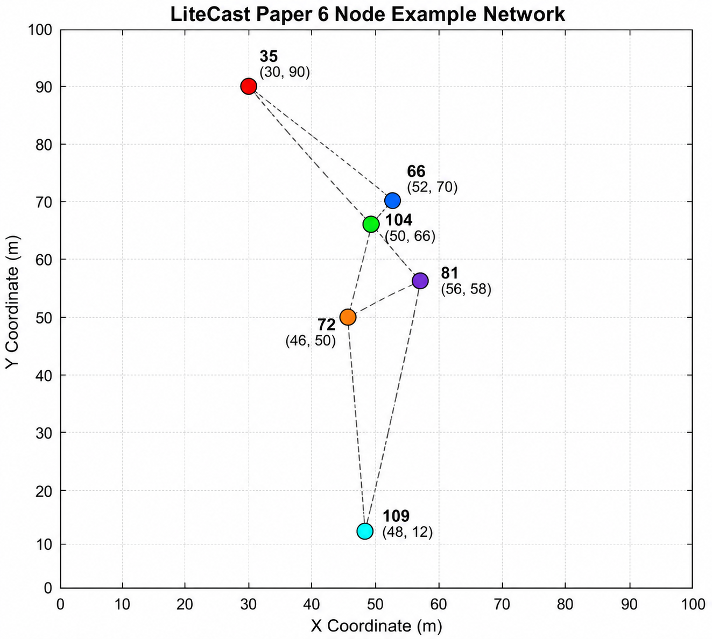

# LiteCast Paper 6 Node Example Network

This folder contains the **6-node example network** used in the LiteCast paper.

## Topology Configuration

- **Number of Nodes:** 6
- **Center Node ID:** 104

## Node Positions

The following C++ `NodePositions` vector defines the `(x, y)` coordinates of the six nodes. fileciteturn5file0L6-L12

```cpp
vector<pair<double,double>> NodePositions = {
    {30, 90},   //35
    {52, 70},   //66
    {50, 66},   //104
    {46, 50},   //72
    {56, 58},   //81
    {48, 12}    //109
};
```

## Nodes Initialization

Each node is initialized with its node ID, position, and list of neighboring nodes. fileciteturn5file0L17-L22

```cpp
Nodes[35]  = new Node(35,  NodePositions[0].first, NodePositions[0].second, vector<int>{66,104});
Nodes[66]  = new Node(66,  NodePositions[1].first, NodePositions[1].second, vector<int>{35,104});
Nodes[104] = new Node(104, NodePositions[2].first, NodePositions[2].second, vector<int>{35,66,72,81});
Nodes[72]  = new Node(72,  NodePositions[3].first, NodePositions[3].second, vector<int>{81,104,109});
Nodes[81]  = new Node(81,  NodePositions[4].first, NodePositions[4].second, vector<int>{72,104,109});
Nodes[109] = new Node(109, NodePositions[5].first, NodePositions[5].second, vector<int>{72,81});
```

## Topology Visualization

The following figure shows the **LiteCast Paper 6 Node Example Network**, including the node IDs, coordinates, and connectivity.



